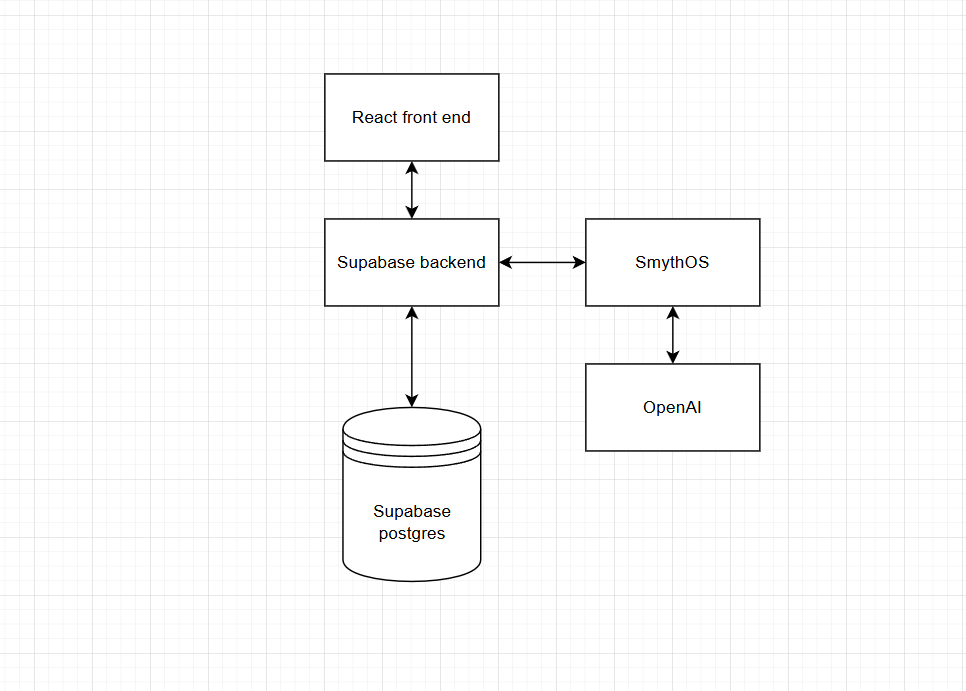

# VenueHub

VenueHub is a platform designed to simplify the process of finding, booking, and managing venues for events. Whether you're planning a conference, wedding, or casual gathering, VenueHub connects you with the right space and makes event organization seamless.

---

## Features

- **Venue Listings:** Browse a wide variety of venues with detailed descriptions, images, and amenities.
- **Booking System:** Reserve venues directly through the platform with real-time availability.
- **Search & Filter:** Find venues by location, size, type, price, and special features.
- **User Accounts:** Create profiles to save favorite venues, manage bookings, and leave reviews.
- **Venue Management:** Venue owners can list their spaces, manage bookings, and communicate with clients.
- **Reviews & Ratings:** Read and write reviews to help others find the perfect venue.
- **AI Venue Assistant:** Get personalized recommendations for venues using our intelligent assistant.

---

## Screenshots

### Venue Browsing

 <!-- Image 1 -->

### AI Venue Assistant

 <!-- Image 2 -->

---

## Architecture

### Agent Architecture

### System Overview

 <!-- Image 3 -->

### Data & Interaction Flow

 <!-- Image 4 -->

---

## Usage

- **Browse Venues:** Use the search bar and filters to find your ideal venue.
- **Book a Venue:** Select dates and submit a booking request.
- **Manage Listings:** Venue owners can add new listings, update details, and track bookings.
- **Leave Reviews:** After your event, share feedback to help future users.
- **AI Assistant:** Ask for venue recommendations and get instant, tailored results.

---

## Contributing

Contributions are welcome! Please fork the repository and submit a pull request. For major changes, open an issue first to discuss what you'd like to change.

1. Fork the repo
2. Create your feature branch (`git checkout -b feature/AmazingFeature`)
3. Commit your changes (`git commit -m 'Add some AmazingFeature'`)
4. Push to the branch (`git push origin feature/AmazingFeature`)
5. Open a Pull Request

---

## License

This project is licensed under the [MIT License](LICENSE).

---

## Contact

- **Author:** [nitahieb](https://github.com/nitahieb)

---

*VenueHub — Making venue booking effortless and reliable.*
